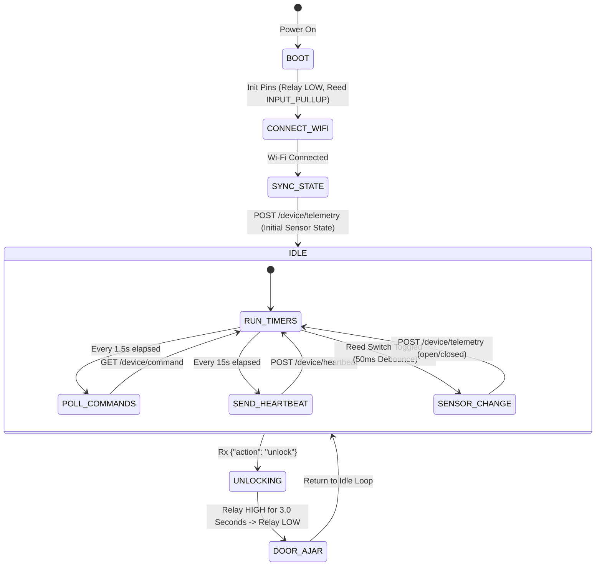

# Firmware & IoT Integration Guide (ESP32 - Pure REST/HTTP)

This document specifies the software communication contracts, HTTP endpoints, timing requirements, and backend REST APIs required for developing the firmware of the **Smart Delivery Box** using pure **REST/HTTP**.

---

## 1. Core Operating Philosophy: "Push-to-Lock"

The locker operates on a **power-to-unlock, push-to-lock** paradigm:

1. **Unlock Phase**: Upon receiving an unlock command from the backend, the firmware energizes the solenoid latch for **exactly 3 seconds**, then cuts off power.
2. **Deposit & Lock Phase**: The courier opens the door, places the parcel inside, and **physically pushes the door shut** (spring-loaded latch catches mechanically).
3. **Closure Detection**: The firmware **never receives a "Lock" command**. Locking is 100% mechanical. The firmware detects closure via the door state sensor (reed switch) and immediately posts a telemetry event.

---

## 2. REST/HTTP IoT Communication Specification

All communication between the microcontroller (ESP32) and the cloud backend occurs over standard **HTTP/HTTPS**. No external message brokers or persistent TCP sockets (e.g., MQTT) are required.

### Connection Parameters

| Parameter | Development / Bench Test | Production | Description |
| :--- | :--- | :--- | :--- |
| **Protocol** | `http://` | `https://` | Standard REST/JSON over TCP |
| **Default Port** | `4300` | `443` | Backend listening port |
| **Base API URL** | `http://<SERVER_IP>:4300/api` | `https://api.yourdomain.com/api` | API root path |
| **Poll Interval** | `1500 ms` (1.5 seconds) | `1000 - 2000 ms` | Frequency to check for user unlock commands |
| **Heartbeat Interval**| `15000 ms` (15 seconds) | `15000 - 30000 ms` | Ping interval to maintain online presence in app |
| **Watchdog Timeout** | `30000 ms` (30 seconds) | `30000 ms` | Backend marks device offline if missed |

---

### Endpoints & Payload Contracts

#### A. Command Polling (Locker &rarr; Cloud Backend)

The ESP32 periodically queries the backend to check if an authorized user has triggered an unlock command.

* **Method:** `GET`
* **Endpoint:** `/device/command?deviceId={DEVICE_ID}`
* **Headers:** `Content-Type: application/json`, optionally `X-Device-Id: {DEVICE_ID}`

**Response 1 — Unlock Command Pending (200 OK):**
```json
{
  "action": "unlock",
  "commandId": "cmd_1788523000_a1b2c",
  "timestamp": "2026-09-05T10:45:00.000Z"
}
```

**Response 2 — No Pending Command (200 OK):**
```json
{
  "action": "none"
}
```

**Firmware Handling Rules:**
1. If `action == "unlock"`, immediately energize the relay pin **HIGH**.
2. Start a **non-blocking timer** (`millis()`) for **3000 ms (3 seconds)**.
3. Once 3 seconds elapse, de-energize the relay pin back to **LOW**.
4. Do **NOT** block the main loop with `delay()`—keep network timers and sensor checks running smoothly.

---

#### B. Door State Telemetry (Locker &rarr; Cloud Backend)

Published **immediately** whenever the reed switch sensor toggles state (`open` or `closed`), as well as once on initial boot to synchronize state.

* **Method:** `POST`
* **Endpoint:** `/device/telemetry`
* **Headers:** `Content-Type: application/json`

**Request Payload:**
```json
{
  "deviceId": "BOX_001",
  "doorState": "closed"
}
```

**Field Specifications:**
| Field | Type | Allowed Values | Description |
| :--- | :--- | :--- | :--- |
| `deviceId` | `string` | e.g. `"BOX_001"` | Unique device identifier registered in backend |
| `doorState` | `string` | `"open"` \| `"closed"` | Current debounced state of the door reed switch |

**Response (200 OK):**
```json
{
  "success": true,
  "doorState": "closed",
  "online": true
}
```

*Note: When `doorState: "closed"` is received by the backend, the backend automatically logs `delivery_success`, triggers push/email notifications to the homeowner, and broadcasts real-time updates to the mobile app.*

---

#### C. Periodic Heartbeat (Locker &rarr; Cloud Backend)

Sent every 15 seconds to report that the microcontroller is healthy, powered, and connected to Wi-Fi.

* **Method:** `POST`
* **Endpoint:** `/device/heartbeat`
* **Headers:** `Content-Type: application/json`

**Request Payload:**
```json
{
  "deviceId": "BOX_001"
}
```

**Response (200 OK):**
```json
{
  "success": true,
  "online": true,
  "timestamp": "2026-09-05T10:45:15.000Z"
}
```

---

## 3. Firmware State Machine



---

## 4. Backend REST API Reference for App & Diagnostics

For testing, provisioning, or bench testing on the hardware workbench:

### 1. Direct Hardware Bench-Test Endpoint (No Auth Required)
Allows hardware engineers to trigger an unlock command directly:
* **POST** `/test/unlock`
  ```json
  // Request
  { "deviceId": "BOX_001" }

  // Response (200 OK)
  {
    "success": true,
    "message": "Bench test unlock command queued for BOX_001",
    "targetDeviceId": "BOX_001",
    "commandId": "cmd_1788523000_x9y8z"
  }
  ```

### 2. User Authenticated Endpoints (Bearer JWT Required)
* **POST** `/api/devices/:id/unlock`: Enqueues an unlock command for the device.
* **GET** `/api/devices`: Lists user's paired lockers.
* **POST** `/api/devices`: Pairs a new locker to user's account (`{ "deviceId": "BOX_001", "name": "Porch Locker" }`).
* **GET** `/api/devices/:id/logs`: Retrieves audit log history.

---

## 5. Sample ESP32 Implementation (Arduino / C++)

Below is a complete, production-ready reference implementation using standard `WiFi.h`, `HTTPClient.h`, and `ArduinoJson`:

```cpp
#include <WiFi.h>
#include <HTTPClient.h>
#include <ArduinoJson.h>

// Wi-Fi Configuration
const char* WIFI_SSID     = "YOUR_WIFI_SSID";
const char* WIFI_PASSWORD = "YOUR_WIFI_PASSWORD";

// Backend API Base URL (adjust IP/port for local development or production domain)
const char* API_BASE_URL  = "http://192.168.0.100:4300/api";
const char* DEVICE_ID     = "BOX_001";

// Hardware Pin Configuration
const int PIN_ACTUATOR    = 23;  // Relay / Solenoid pulse control pin
const int PIN_DOOR_SENSOR = 22;  // Reed switch door sensor (INPUT_PULLUP)

// Timing Constants (Non-blocking)
const unsigned long UNLOCK_DURATION     = 3000;   // 3-second power pulse
const unsigned long POLL_INTERVAL       = 1500;   // Poll command every 1.5 seconds
const unsigned long HEARTBEAT_INTERVAL  = 15000;  // Heartbeat every 15 seconds
const unsigned long DEBOUNCE_DELAY      = 50;     // Sensor debounce (ms)

// State Tracking
bool isUnlocking = false;
unsigned long unlockStartTime = 0;

unsigned long lastPollTime = 0;
unsigned long lastHeartbeatTime = 0;

int lastSensorReading = -1;
unsigned long lastDebounceTime = 0;

WiFiClient client;

// Forward declarations
void pollCommand();
void sendTelemetry(const char* stateStr);
void sendHeartbeat();
void monitorDoorSensor();
void manageActuatorTimer();
void connectWiFi();

void setup() {
  Serial.begin(115200);
  
  pinMode(PIN_ACTUATOR, OUTPUT);
  digitalWrite(PIN_ACTUATOR, LOW);
  pinMode(PIN_DOOR_SENSOR, INPUT_PULLUP);

  connectWiFi();

  // Initial State Resynchronization: Post actual door state immediately on boot
  int initialReading = digitalRead(PIN_DOOR_SENSOR);
  lastSensorReading = initialReading;
  sendTelemetry((initialReading == LOW) ? "closed" : "open");
  sendHeartbeat();
}

void loop() {
  // Ensure Wi-Fi stays connected
  if (WiFi.status() != WL_CONNECTED) {
    connectWiFi();
  }

  // 1. Manage 3-second non-blocking pulse
  manageActuatorTimer();

  // 2. Monitor reed switch for immediate door state changes
  monitorDoorSensor();

  // 3. Periodic command polling (every 1.5s)
  if (millis() - lastPollTime >= POLL_INTERVAL) {
    lastPollTime = millis();
    pollCommand();
  }

  // 4. Periodic heartbeat (every 15s)
  if (millis() - lastHeartbeatTime >= HEARTBEAT_INTERVAL) {
    lastHeartbeatTime = millis();
    sendHeartbeat();
  }
}

// Wi-Fi Connection Routine
void connectWiFi() {
  Serial.printf("Connecting to Wi-Fi: %s ...\n", WIFI_SSID);
  WiFi.mode(WIFI_STA);
  WiFi.begin(WIFI_SSID, WIFI_PASSWORD);
  
  while (WiFi.status() != WL_CONNECTED) {
    delay(500);
    Serial.print(".");
  }
  Serial.printf("\nWi-Fi Connected! IP: %s\n", WiFi.localIP().toString().c_str());
}

// 1. Non-blocking Actuator Timer (3 Seconds Pulse)
void manageActuatorTimer() {
  if (isUnlocking && (millis() - unlockStartTime >= UNLOCK_DURATION)) {
    digitalWrite(PIN_ACTUATOR, LOW);
    isUnlocking = false;
    Serial.println("Actuator de-energized (Latch ready for push-to-lock).");
  }
}

// 2. Poll Command from Backend: GET /api/device/command?deviceId=BOX_001
void pollCommand() {
  if (WiFi.status() != WL_CONNECTED) return;

  HTTPClient http;
  char url[128];
  snprintf(url, sizeof(url), "%s/device/command?deviceId=%s", API_BASE_URL, DEVICE_ID);

  http.begin(client, url);
  int httpCode = http.GET();

  if (httpCode == HTTP_CODE_OK) {
    String payload = http.getString();
    JsonDocument doc;
    DeserializationError error = deserializeJson(doc, payload);

    if (!error) {
      const char* action = doc["action"];
      if (action && strcmp(action, "unlock") == 0) {
        Serial.println("Unlock command received! Firing 3-second actuator pulse...");
        digitalWrite(PIN_ACTUATOR, HIGH);
        isUnlocking = true;
        unlockStartTime = millis();
      }
    }
  }
  http.end();
}

// 3. Send Door State Telemetry: POST /api/device/telemetry
void sendTelemetry(const char* stateStr) {
  if (WiFi.status() != WL_CONNECTED) return;

  HTTPClient http;
  char url[128];
  snprintf(url, sizeof(url), "%s/device/telemetry", API_BASE_URL);

  http.begin(client, url);
  http.addHeader("Content-Type", "application/json");

  JsonDocument doc;
  doc["deviceId"] = DEVICE_ID;
  doc["doorState"] = stateStr;

  String requestBody;
  serializeJson(doc, requestBody);

  int httpCode = http.POST(requestBody);
  if (httpCode == HTTP_CODE_OK) {
    Serial.printf("Telemetry posted successfully: %s\n", stateStr);
  } else {
    Serial.printf("Telemetry POST failed, HTTP code: %d\n", httpCode);
  }
  http.end();
}

// 4. Send Heartbeat: POST /api/device/heartbeat
void sendHeartbeat() {
  if (WiFi.status() != WL_CONNECTED) return;

  HTTPClient http;
  char url[128];
  snprintf(url, sizeof(url), "%s/device/heartbeat", API_BASE_URL);

  http.begin(client, url);
  http.addHeader("Content-Type", "application/json");

  JsonDocument doc;
  doc["deviceId"] = DEVICE_ID;

  String requestBody;
  serializeJson(doc, requestBody);

  int httpCode = http.POST(requestBody);
  if (httpCode == HTTP_CODE_OK) {
    Serial.println("Heartbeat ping acknowledged by backend.");
  }
  http.end();
}

// 5. Debounced Door State Sensor Monitor
void monitorDoorSensor() {
  int reading = digitalRead(PIN_DOOR_SENSOR);

  if (reading != lastSensorReading && (millis() - lastDebounceTime > DEBOUNCE_DELAY)) {
    lastDebounceTime = millis();
    lastSensorReading = reading;

    // Typically: LOW = Closed (magnet touches switch), HIGH = Open (door popped open)
    const char* stateStr = (reading == LOW) ? "closed" : "open";
    Serial.printf("Door sensor transition detected: %s\n", stateStr);
    sendTelemetry(stateStr);
  }
}
```

---

## 6. Critical Firmware Requirements Checklist

- [x] **Zero MQTT Overhead**: Simple HTTP/REST requests; no TCP broker connections.
- [x] **Non-blocking Loop**: Never use `delay()` in `loop()`; rely strictly on `millis()` timers.
- [x] **3-Second Solenoid Protection**: Actuator must automatically cut off after 3 seconds to prevent coil overheating.
- [x] **Software Debounce**: 50ms debounce on the reed switch prevents erratic contact bounces.
- [x] **Boot State Sync**: Always read and post current door state on boot to handle outages gracefully.
- [x] **Auto Reconnection**: Automatically re-establishes Wi-Fi connectivity if interrupted.
